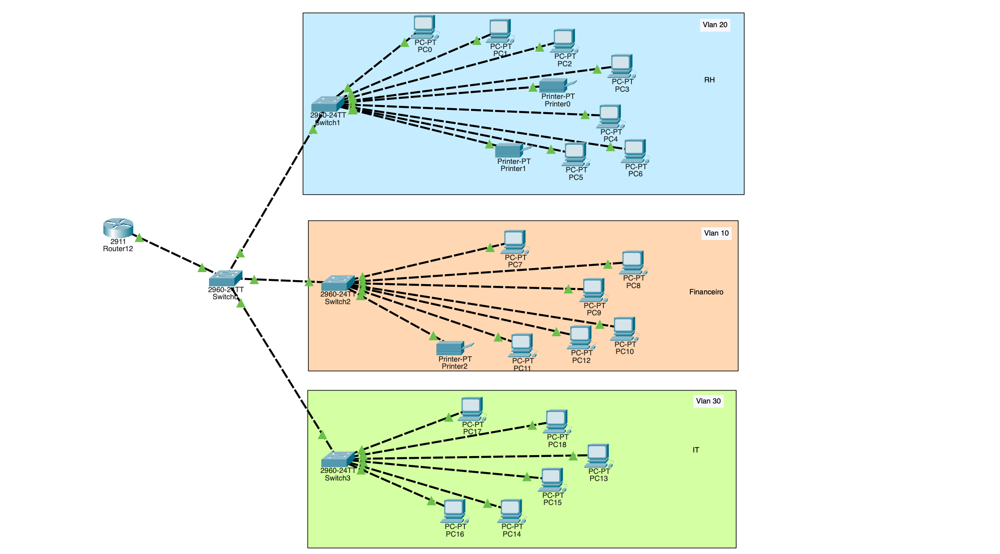

# Empresa com 3 Departamentos

## Contexto do projecto

Este projecto consiste na implementação de uma infraestrutura de rede para uma empresa com **três departamentos: Financeiro, RH e IT**.

O principal objectivo foi utilizar **VLANs** para realizar a segmentação lógica da rede, separando os dispositivos de cada departamento e permitindo um maior controlo sobre a comunicação entre diferentes grupos de utilizadores.

A infraestrutura foi desenvolvida e testada no **Cisco Packet Tracer**, utilizando switches e um router para implementar a comunicação entre as diferentes VLANs.

Do ponto de vista de administração de redes, o projecto foi desenvolvido para:

- Criar VLANs para os departamentos **Financeiro, RH e IT**.
- Associar as portas dos switches às VLANs correspondentes.
- Configurar **trunking 802.1Q** para transportar múltiplas VLANs entre os equipamentos.
- Implementar **Inter-VLAN Routing** para permitir a comunicação entre diferentes VLANs.
- Configurar endereçamento IPv4 para os diferentes segmentos da rede.
- Testar a conectividade entre os departamentos.
- Compreender como a segmentação lógica pode melhorar a organização e administração de uma rede empresarial.

## Tecnologias utilizadas

- Cisco Packet Tracer
- VLANs
- IEEE 802.1Q
- Trunking
- Inter-VLAN Routing
- IPv4
- Switching
- ICMP / Ping
- Cisco IOS

# Resumo executivo

### Visão geral do projecto

O laboratório teve como objectivo construir uma rede empresarial dividida em três departamentos: **Financeiro, RH e IT**.

Para realizar esta divisão, foram criadas VLANs independentes para cada departamento. Esta abordagem permitiu separar logicamente os dispositivos, mesmo quando estes utilizam a mesma infraestrutura física de switching.

Foi utilizado **trunking** para transportar o tráfego das diferentes VLANs entre os equipamentos de rede. Para permitir a comunicação entre departamentos, foi implementado **Inter-VLAN Routing** através de um router.

Após a implementação, foram realizados testes de conectividade para verificar o funcionamento da comunicação dentro das VLANs e entre diferentes VLANs.

### Principais conhecimentos adquiridos

1. **Segmentação através de VLANs:**

   Aprendi a utilizar VLANs para dividir logicamente uma rede física em diferentes segmentos.

   Compreendi que dispositivos ligados ao mesmo switch podem pertencer a redes lógicas diferentes, proporcionando uma melhor organização e separação do tráfego.

2. **Configuração de portas de acesso:**

   Aprendi a configurar portas dos switches como **Access Ports** e a associá-las às VLANs correspondentes.

   Desta forma, os computadores de cada departamento passaram a pertencer à VLAN definida para o seu sector.

3. **Trunking 802.1Q:**

   Aprendi a configurar links **Trunk** para transportar o tráfego de múltiplas VLANs através de uma única ligação física.

   Compreendi a importância do protocolo **802.1Q** na identificação das VLANs durante a transmissão do tráfego através dos links trunk.

4. **Inter-VLAN Routing:**

   Aprendi que dispositivos pertencentes a VLANs diferentes não conseguem comunicar directamente através de switching Layer 2.

   Para permitir essa comunicação, implementei **Inter-VLAN Routing**, utilizando interfaces/subinterfaces no router como gateways das diferentes VLANs.

5. **Endereçamento IPv4:**

   Aprendi a utilizar diferentes sub-redes IPv4 para representar os diferentes segmentos da rede.

   Cada VLAN passou a possuir a sua própria sub-rede e gateway, permitindo uma estrutura de endereçamento organizada.

6. **Troubleshooting:**

   Aprendi a validar a configuração das VLANs, trunks e routing através de comandos de verificação e testes de conectividade.

   A utilização de ferramentas como `ping` e comandos `show` permitiu identificar e corrigir problemas de configuração.

# Análise aprofundada

### Categoria 1: Segmentação da rede através de VLANs

A primeira etapa consistiu na criação de VLANs específicas para cada departamento:

| VLAN | Departamento |
|------|--------------|
| VLAN 10 | Financeiro |
| VLAN 20 | RH |
| VLAN 30 | IT |

Esta configuração permitiu separar logicamente os três departamentos dentro da mesma infraestrutura física.

  

A utilização de VLANs permitiu compreender na prática como uma organização pode estruturar a sua rede de acordo com departamentos, funções ou níveis de acesso.

### Categoria 2: Configuração das portas de acesso

Depois da criação das VLANs, as portas dos switches foram configuradas como **Access Ports** e associadas aos respectivos departamentos.

Os computadores do Financeiro foram associados à **VLAN 10**, os computadores do RH à **VLAN 20** e os computadores do IT à **VLAN 30**.

Esta configuração permitiu compreender a diferença entre uma porta de acesso e uma porta trunk e como cada uma é utilizada numa rede baseada em VLANs.

### Categoria 3: Trunking

Para permitir que diferentes VLANs fossem transportadas entre os equipamentos de rede, foram configuradas ligações **Trunk**.

O trunk permitiu transportar simultaneamente o tráfego das VLANs 10, 20 e 30 através da mesma ligação física.

A implementação do **802.1Q** permitiu compreender como os frames Ethernet podem ser identificados de acordo com a VLAN a que pertencem quando atravessam uma ligação trunk.

### Categoria 4: Inter-VLAN Routing

Como cada VLAN representa um segmento de rede diferente, foi necessário implementar routing para permitir a comunicação entre os departamentos.

Foi configurado **Inter-VLAN Routing** através do router, utilizando uma interface/subinterface para cada VLAN.

Cada VLAN possui o seu próprio gateway, permitindo que o router encaminhe o tráfego entre diferentes redes.

Esta etapa permitiu compreender na prática a diferença entre:

- Comunicação dentro da mesma VLAN;
- Comunicação entre VLANs;
- Switching Layer 2;
- Routing Layer 3.

### Categoria 5: Testes de conectividade

Após a implementação da infraestrutura, foram realizados testes para validar o funcionamento da rede.

Os testes incluíram:

- Comunicação entre computadores da mesma VLAN;
- Comunicação entre computadores de VLANs diferentes;
- Verificação dos endereços IP;
- Verificação dos gateways;
- Verificação das VLANs configuradas;
- Verificação das interfaces trunk;
- Testes utilizando `ping`.

A realização destes testes permitiu desenvolver conhecimentos de **troubleshooting em redes Cisco**, verificando cada camada da configuração até identificar possíveis problemas.

# Resultado final

A implementação resultou numa rede empresarial segmentada em **três VLANs**, representando os departamentos de Financeiro, RH e IT.

A utilização de VLANs permitiu melhorar a organização lógica da infraestrutura, enquanto o trunking possibilitou o transporte de múltiplas VLANs entre os equipamentos.

Com a implementação de **Inter-VLAN Routing**, foi possível estabelecer comunicação entre diferentes segmentos da rede através do router.

O projecto permitiu consolidar conhecimentos fundamentais de **VLANs, Access Ports, Trunking 802.1Q, Inter-VLAN Routing, IPv4 e troubleshooting**, servindo como base para projectos de redes mais avançados.

## Competências desenvolvidas

- Configuração de VLANs
- Configuração de Access Ports
- Configuração de Trunk Ports
- Trunking 802.1Q
- Inter-VLAN Routing
- Endereçamento IPv4
- Configuração de gateways
- Testes de conectividade
- Troubleshooting de redes Cisco
- Utilização de Cisco IOS
